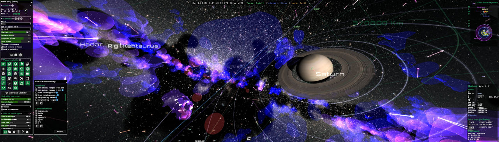

# Gaia Sky

[](https://opensource.org/licenses/MPL-2.0)
[](http://gaia.ari.uni-heidelberg.de/gaiasky/docs/html/latest)
[](https://gitlab.com/langurmonkey/gaiasky/issues)

[**Gaia Sky**](https://zah.uni-heidelberg.de/gaia/outreach/gaiasky) is a real-time 3D Universe application that
runs on Linux, Windows and macOS. It is developed in the framework of
[ESA](http://www.esa.int/ESA)'s [Gaia mission](http://sci.esa.int/gaia) to chart about 1 billion stars of our Galaxy.

Gaia Sky is described in the paper [Gaia Sky: Navigating the Gaia Catalog](http://dx.doi.org/10.1109/TVCG.2018.2864508).



To get the latest up-to-date and most complete information,

*  Visit our [**home page**](https://zah.uni-heidelberg.de/gaia/outreach/gaiasky)
*  Read the [**Documentation**](http://gaia.ari.uni-heidelberg.de/gaiasky/docs/html/latest)
*  Submit a [**bug** or a **feature request**](https://gitlab.com/langurmonkey/gaiasky/issues)
*  Follow development news at [@GaiaSky_Dev](https://twitter.com/GaiaSky_Dev)

This file contains the following sections:

1. [Installation instructions and requirements](#1-installation-instructions-and-requirements)
2. [Running instructions](#2-running-instructions)
3. [Documentation and help](#3-documentation-and-help)
4. [Copyright and licensing information](#4-copyright-and-licensing-information)
5. [Contact information](#5-contact-information)
6. [Credits and acknowledgements](#6-acknowledgements)
7. [Gaia Sky VR](#7-gaia-sky-vr)

##  1. Installation instructions and requirements

### 1.1 Requirements

| **Operating system**  | Linux / Windows 7+ / macOS                                                     |
| :-------------------: | :----------------------------------------------------------------------------- |
| **CPU**               | Intel Core i5 3rd Generation or similar                                        |
| **GPU**               | Intel HD 4000, Nvidia GeForce 9800 GT, Radeon HD 5670 / 1 GB VRAM / OpenGL 3.3 |
| **Memory**            | 4+ GB RAM                                                                      |
| **Hard drive**        | 1 GB of free disk space                                                        |

### 1.2 Installation and uninstallation

Depending on your system and your personal preferences the installation
procedure may vary. Below is a description of the various installation methods
available. You can download the packages [here](https://zah.uni-heidelberg.de/gaia/outreach/gaiasky/downloads/).

#### 1.2.1 Linux

We provide 4 packages for linux systems. `deb`, `rpm`, an `aur` package and a linux installer. You can get them [here](https://zah.uni-heidelberg.de/gaia/outreach/gaiasky/downloads/).
The `aur` package can be installed using any `AUR` helper.

##### 1.2.1.1 DEB

This is the package for Debian-based distros (Debian, Ubuntu, Mint, SteamOS, etc.).
Download the `gaiasky_linux_<version>.deb` file and run the
following command. You will need root privileges to install a `deb` package in
your system.

```
$  dpkg -i gaiasky_linux_<version>.deb
```

This will install the application in the `/opt/gaiasky/` folder
and it will create the necessary shortcuts.

In order to **uninstall**, just type:

```
$  apt remove gaiasky
```
##### 1.2.1.2 AUR

We also provide an [AUR package](https://aur.archlinux.org/packages/gaiasky/) called `gaiasky`. You can install it easily with any tool capable of accessing `AUR`, for example `yay`.

```
$  yay -S gaiasky
```
 
##### 1.2.1.3 RPM

This is the package for RPM-based distributions (Red Hat, Fedora, Mandriva, SUSE, CentOS, etc.)
Download the `gaiasky_linux_<version>.rpm` file and run the
following command. You will need root privileges to install a `rpm` package in
your system.

```
$  rpm -ivh --nodigest gaiasky_linux_<version>.rpm
```

This will install the application in the `/opt/gaiasky/` folder
and it will create the necessary shortcuts.

In order to **uninstall** using `yum` (replace by `dnf` if needed), just type:

```
$  yum remove gaiasky.x86_64
```

##### 1.2.1.4 Linux installer

We also provide a Linux installer ([here](https://zah.uni-heidelberg.de/gaia/outreach/gaiasky/downloads/)) which will trigger a graphical interface
where you can choose the installation location and some other settings.
Download the file `gaiasky_unix_<version>.sh` to your disk.
Then run the following to start the installation.

```
$  ./gaiasky_unix_[version].sh
```

Follow the on-screen instructions to proceed with the installation.

In order to **uninstall**, just run the `uninstall` file in the
installation folder.

#### 1.2.2 Windows

Two windows installers are available for 32 and 64-bit systems [here](https://zah.uni-heidelberg.de/gaia/outreach/gaiasky/downloads/).

- `gaiasky_windows_<version>.exe` - 32 bit installer.
- `gaiasky_windows-x64_<version>.exe` - 64 bit installer.

Both versions will automatically install the JRE if it is not present
in the system.
To install Gaia Sky, just double click on the installer and
then follow the on-screen instructions. You will need to choose the
directory where the application is to be installed.

In order to **uninstall** the application you can use the Windows Control Panel or
you can use the provided uninstaller in the Gaia Sky folder.

#### 1.2.3 macOS

For macOS we provide a `gaiasky_macos_<version>.dmg` file
which is installed by double-clicking on it and following the on-screen instructions. Get it [here](https://zah.uni-heidelberg.de/gaia/outreach/gaiasky/downloads/). Once unpacked, you can run it by clicking on it.

#### 1.2.4 Compressed (TGZ) package

A `gaiasky-<version>.tgz` package file is also provided. It will work
in all systems but you need to unpack it yourself and create the desired
shortcuts.

In **Windows**, use an archiver software (7zip, iZArc, etc.) to unpack it.
When using the `tgz` package, uou need to install the [JRE8](http://www.oracle.com/technetwork/java/javase/downloads/jre8-downloads-2133155.html) yourself.

In **Linux** and **macOS**, you can use:

```
$  tar -zxvf gaiasky-<version>.tgz
```

##  2. Running instructions

### 2.1 Running Gaia Sky

In order to run the program just click on the shortcut
provided in your operating system or use the CLI command `gaiasky`.


### 2.2 Running from source

In order to compile and run Gaia Sky from source, you need the following installed in your system:

- `JDK8`
- `git`

First, clone the [GitLab](https://gitlab.com/langurmonkey/gaiasky) repository:

```
$  git clone https://gitlab.com/langurmonkey/gaiasky.git
```


#### 2.2.2 Running

Finally, run Gaia Sky (Linux, macOS) with the provided script:

```
$  gaiasky
```

On Windows, do:

```
.\gradlew.bat core:run
```

Et voilà ! The bleeding edge Gaia Sky is running in your machine.


### 2.4 CLI arguments

Run `gaiasky -h` or `man gaiasky` to find out about how to launch Gaia Sky and what arguments are accepted.

### 2.5 Getting the data

As of version `2.1.0`, Gaia Sky offers an automated way to download all data packs and catalogs from within the application. When Gaia Sky starts, if no base data or catalogs are found, the downloader window will prompt automatically. Otherwise, you can force the download window at startup with the `-d` argument. Just select the data packs and catalogs that you want to download, press `Download now` and wait for the process to finish.

You can also download the **data packs manually** [here](http://gaia.ari.uni-heidelberg.de/gaiasky/files/autodownload/).


##  3. Documentation and help

The most up-to-date documentation of Gaia Sky is always in [gaia.ari.uni-heidelberg.de/gaiasky/docs/html/latest](http://gaia.ari.uni-heidelberg.de/gaiasky/docs/html/latest). For older versions and other formats, see [here](http://gaia.ari.uni-heidelberg.de/gaiasky/docs).

We also have a mirror at [gaia-sky.rtfd.org](https://gaia-sky.readthedocs.io).

### 3.1. Documentation submodule

In order to add the documentation submodule to the project, do:

```
$  git submodule init
$  git submodule update
```

The documentation project will be checked out in the `docs/` folder.

##  4. Copyright and licensing information

This software is published and distributed under the MPL 2.0
(Mozilla Public License 2.0). You can find the full license
text here https://gitlab.com/langurmonkey/gaiasky/blob/master/LICENSE.md
or visiting https://opensource.org/licenses/MPL-2.0

##  5. Contact information

The main webpage of the project is
**[https://www.zah.uni-heidelberg.de/gaia/outreach/gaiasky](https://www.zah.uni-heidelberg.de/gaia/outreach/gaiasky)**. There you can find
the latest versions and the latest information on Gaia Sky.

##  6. Acknowledgements

The latest acknowledgements are always in the [ACKNOWLEDGEMENTS.md](https://gitlab.com/langurmonkey/gaiasky/blob/master/ACKNOWLEDGEMENTS.md) file.

##  7. Gaia Sky VR

There exists a development version of Gaia Sky which works with the VR headsets supporting OpenVR. More information on this is available in the [README.md file on the vr branch](https://gitlab.com/langurmonkey/gaiasky/blob/vr/README.md).
